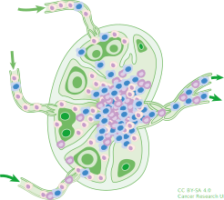

# lymph
Generic Signature Format for System States

 

# What is lymph?

The idea behind **lymph** is to complement the efforts already put into the [YARA](https://github.com/VirusTotal/yara) and [Sigma](https://github.com/Neo23x0/sigma) standards and [different](https://www.snort.org/) [IDS](https://suricata-ids.org/) rulesets. YARA focuses on malware samples (files), Sigma on log events and IDS systems on network traffic. What we found to be missing is a standardized framework to look for suspect/ vulnerable mis-configurations. That is where **lymph** comes in.

The idea is to create a framework of signatures to look for, combined with a way to consult different types and versions of systems for this specific information. The methods to check systems will be as separated as possible from the rulesets, so other ways of getting the information can be added on demand.  To accomplish most of this in one year, **lymph** will borrow as much as possible from the hard work already done by the YARA and Sigma developers (including parts of the documentation). So, to immediately start paraphrasing from the Sigma project:

**Lymph** is to system states what [Sigma](https://github.com/Neo23x0/sigma) is for log files, [Snort](https://www.snort.org/) is for network traffic and [YARA](https://github.com/VirusTotal/yara) is for files.

This repository contains:

- **Lymph** rule specification in the [wiki](https://github.com/avuko/lymph/wiki/Specification) [ Actively working on this part]
  - Open repository for **lymph** signatures in the `./rules`subfolder
  - A converter that generates searches/queries for different query frameworks/target systems [still all in the "*to do*" phase]

# what problem is lymph trying to solve?

Mostly the problem of gleaning through many, many systems hunting for threats. The ultimate goal is combine **lymph** with YARA, Sigma and Snort rules to smoke out APTs and other miscreants quickly and efficiently. This model depends on combining all of the tools available to match patterns of behavior and signs of presence/persistence in networks and systems. The tool that is meant to combine all of these tools to automate the hunting will be build over at [phipps](https://github.com/avuko/phipps).